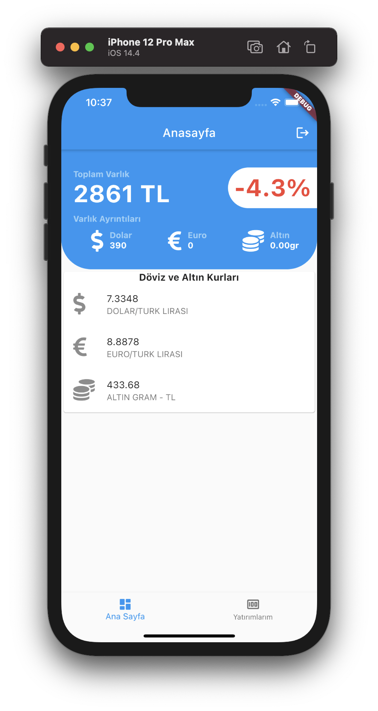
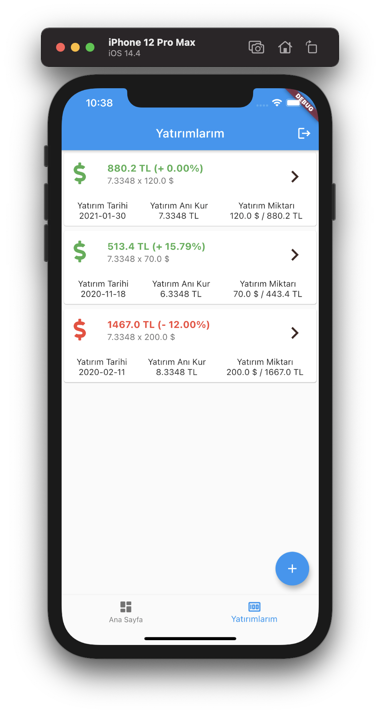
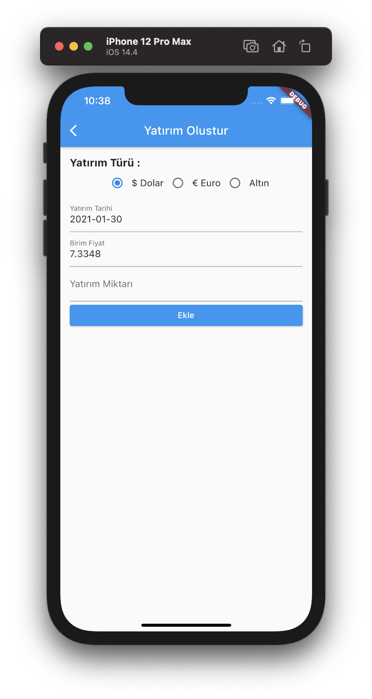
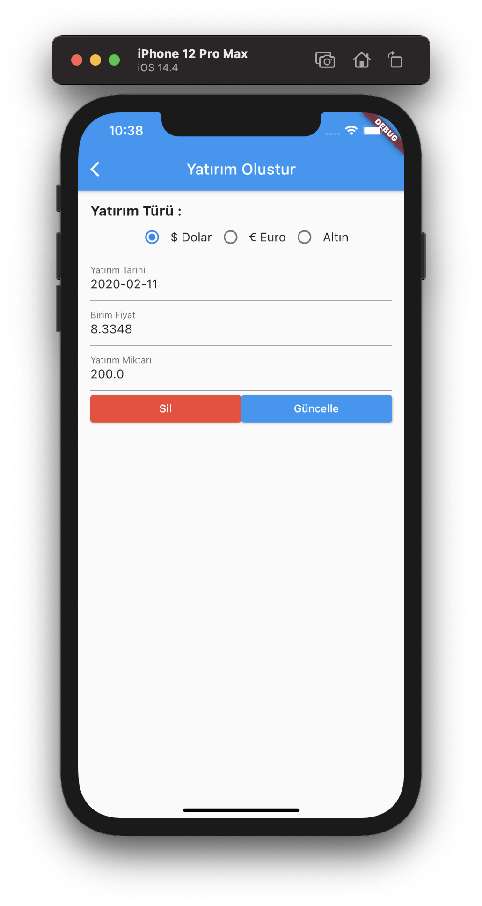

# Simple Investment Tracking App 

Track your investments: follow your profit and loss

- Data is gathered from https://finans.truncgil.com/today.json 

## Dashboard
- Total investment balance
- Percentage of profit
- Today's foreign currency and gold rates

## Investment List
- All investments

## New Investment
- Create new investment

## New Investment
- Update investment

## Author

SchemeSonic, haldun313@gmail.com

## License

Project is available under the MIT license. See the LICENSE file for more info.
